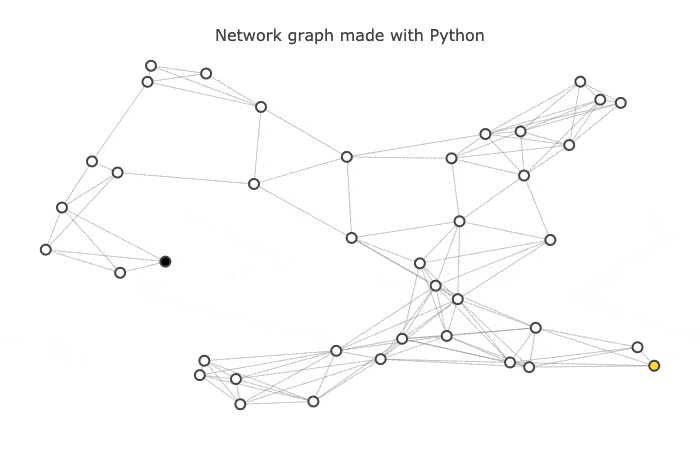

# A* Route Planner

We started on start state and then we start expanding out from there looking at different paths. And what we end up doing is expanding in terms of contours like
on a topological map Where first we expand out to a certain distance then to a farther distance and then to a farther distance then to a farther distance. at some point we meet up with the goal. That is Uniform best cost algorithm.

- 

found a path from the start to the goal.the search really wasn't directed at any way towards the goal.It was expanding out everywhere in this space.and depending on where the goal is , we should expect to have to explore half of the space on average before we find the goal.If the space this small, that can be fine.But when spaces are large, that won't get us to the goal fast enough. If we want to imporve if we want to be able to find the goal faster,We need to add more knowledge.which is most useful in search.Estimate of the distance from state to the goal. we're dealing with a route finding problem. and we can move in any direction up or down, right or left.And we'll take as our estimate the straight line distance between a state and goal.and we'll try to use that estimate to find our way to the goal fastest.

- 

Greedy best-first search does exactly that. It expands first the path that's closest to the goal according to the estimate.So now ,instead of exploring whole circles that go out everywhere in the earch space, our search is directed towards the goal.it gets us immediately towards the goal.But that won't always be the case if there are obstacles along the way.it won't consider going back this way, which is farther from the goal.Rather it will continue expanding out along this lines.which always get closer and closer to the goal.Eventually will find it's ways towards the goal.Now if we can explore it in the other direction,
we could have found a much simpler path a much shorter path,by just popping over the barrier and then going directly to the goal.But greedy best-first search wouldn't have done that because it didn't consider states which were farther from the goal.

- 

A* combines the best parts of greedy search, which explores a small number of nodes in many cases and uniform cost search, which is guaranteed to find the shortest path. the function f, which is defined as a sum of the g and h components. The measure f is a sum of g the path cost so far. The measure f is a sum of g, the path cost so far and h which is the estimated distance that the path will take to complete its path to the goal.Now minimizing g helps us keep the path short. and  minimizing h helps us keep focused on finding the goal.
The result is a search strategy that is the best possible.in the sense that it finds the shorttest length path while expanding the minimum number of paths possible.It could be called best estimated total path cost first. the name A* is traditional

- 

## More resources

- [Udacity Data Structures & Algorithms ND ](https://www.udacity.com)
- [Stanford introduction to A* ](https://theory.stanford.edu/~amitp/GameProgramming/AStarComparison.html)

## Versioning

We use [SemVer](http://semver.org/) for versioning. For the versions available, see the [tags on this repository](https://github.com/your/project/tags).

## Authors

* **Tom** - *Fullstack egineer* - [github profile](https://github.com/tomgtqq)

## License

This project is licensed under the MIT License
